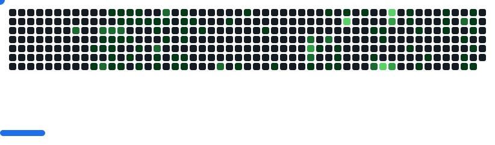

# 👋 Yug Patel

### Full Stack Developer building modern, fast, and delightful web experiences  
**MERN • JavaScript • TypeScript • Next.js**

Focused on **clean code**, **performance**, and **great UX** ✨

| 💻 **GitHub** | 🔗 **LinkedIn** |

---

## 🛠 Tech Stack

### 🎨 Frontend

  

---

### ⚙️ Backend

  
  

---

### ☁️ DevOps & Tools

  
  

---

## 🤝 Connect with me

  
  
  

---

## 📊 GitHub Stats

  

## 🧩 Breakout

  

