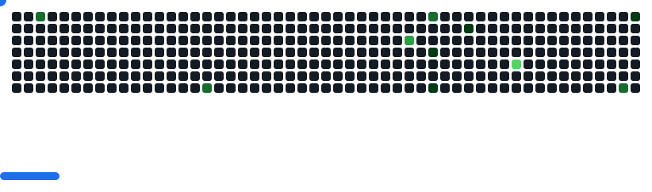

# 👋 Yug Patel

### Full Stack Developer building modern, fast, and delightful web experiences  
**MERN • JavaScript • TypeScript • Next.js**

Focused on **clean code**, **performance**, and **great UX** ✨

| 💻 **GitHub** | 🔗 **LinkedIn** |
## 🤝 Connect with me

  
  
  

---

---

## 🛠 Tech Stack

### 🎨 Frontend

  

---

### ⚙️ Backend

  
  

---

### ☁️ DevOps & Tools

  
  

---

🧩 Breakout &&  📊 GitHub Insights

  

 

<table border="0" width="100%">
  <tr>
    <td width="50%" align="center"><h3>My GitHub Statistics</h3></td>
    <td width="50%" align="center"><h3>Languages</h3></td>
  </tr>
  <tr>
    <td width="50%" align="center">
       
    </td>
    <td width="50%" align="center">
      
    </td>
  </tr>
</table>

